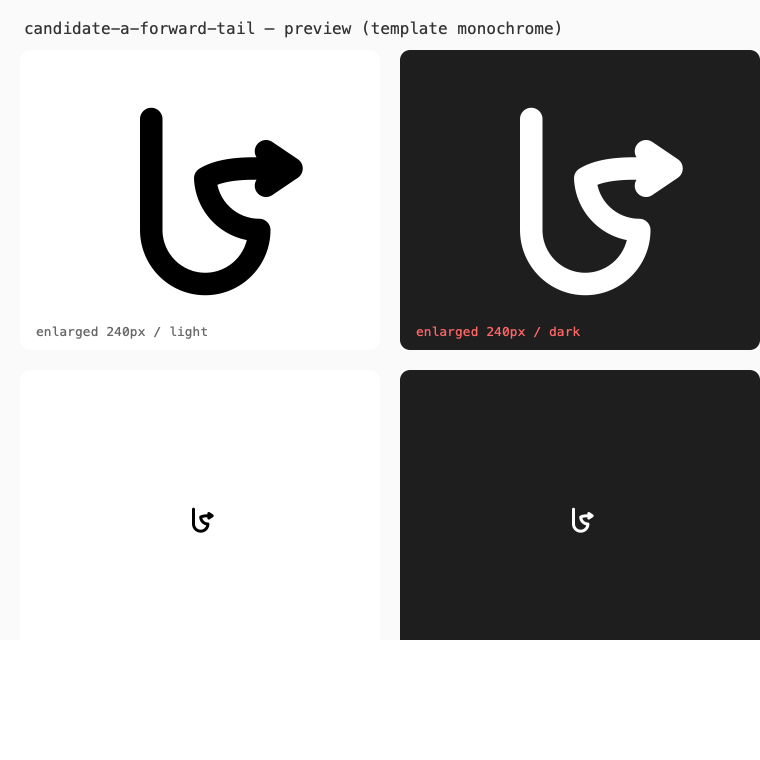
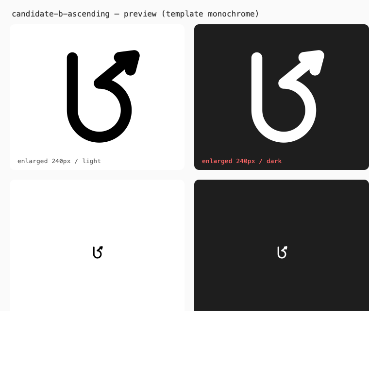
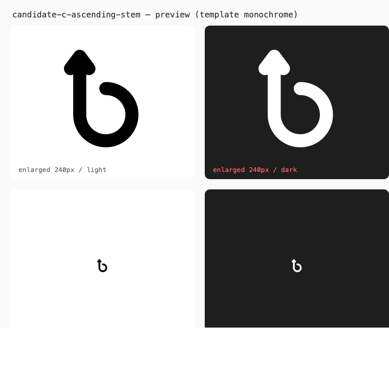

# Menu bar icon candidates — preview only (TASK-0026)

Three candidate glyphs for the macOS menu bar, each a lowercase-b
monogram drawn as **one continuous curved stroke ending in an
arrowhead**. These are **previews for selection only**: nothing in
this directory is wired into the app — `Info.plist`, the shim, and the
packaging are unchanged, and the running handler's icon is still the
SF Symbol from TASK-0022. Final selection and integration require an
explicit user choice; the accessible label remains **Brouter**
regardless of the outcome.

All artwork is template monochrome (solid black with alpha); AppKit
recolors it for light and dark menu bars. Each preview PNG shows the
glyph enlarged (240 px) and at actual menu-bar size (32 px art box) on
light and dark panels.

## Candidates

### Candidate A — forward tail (`candidate-a-forward-tail.svg`)

Stem descends, bowl sweeps bottom → right, and the stroke exits along
the bowl's shoulder into a horizontal tail with a right-pointing
arrowhead. Reads unambiguously as a "b in motion": the arrow points at
the thing being launched.



### Candidate B — ascending (`candidate-b-ascending.svg`)

Bowl swept bottom → right → top, then the stroke rises from the bowl's
top into a diagonal tail with an up-right (↗) arrowhead. Most
"launch/upgrade" energy of the three; the tail leaves tangentially so
nothing crosses the bowl.



### Candidate C — rising stem (`candidate-c-ascending-stem.svg`)

One gesture: the stroke starts at the bowl's top, sweeps the bowl,
flows up the stem, and the stem itself terminates in an upward (↑)
arrowhead — no separate tail. Slightly bolder (1.7 stroke). The bowl is
three-quarters closed where the stem passes it, matching the
continuous-stroke constraint.



## Comparison

| Aspect                | A forward tail                     | B ascending                       | C rising stem                          |
|-----------------------|------------------------------------|-----------------------------------|----------------------------------------|
| Silhouette            | classic b, tail along the shoulder | b with a rising diagonal tail     | b whose stem *is* the arrow            |
| One continuous stroke | yes                                | yes                               | yes                                    |
| Arrow direction       | right (→)                          | up-right (↗)                      | up (↑)                                 |
| Legibility at menu-bar size (in previews) | strong — open counters, familiar gesture | strong — tail clear of the bowl | strong — boldest silhouette of the three |
| Distinctness from the shipped SF Symbol (branch/fork) | high — monogram, no fork | high | high |
| Risks                 | tail adds width beyond the stem+bowl | diagonal tail reduces bowl clearance | open top-left bowl corner               |

Accessibility notes (all candidates): template monochrome so macOS
controls contrast in light and dark appearance; shapes keep ≥1 px
apparent gaps at menu-bar size so they do not merge into a blob;
VoiceOver identity is carried by the accessible label **Brouter**
(unchanged), not by the glyph. Per-candidate contrast behavior cannot
be fully verified from static previews — confirm in the running app
before any integration.

## How these were produced

Vector sources are hand-authored cubic/arc paths (no font, no traced
bitmap). Re-render previews after any edit with:

```sh
qlmanage -t -s 760 -o . <name>-preview.svg
```

Selection process: review the three previews, optionally try one as a
temporary local build; integration (asset pipeline, template handling,
Info.plist) is a separate, user-approved change.
