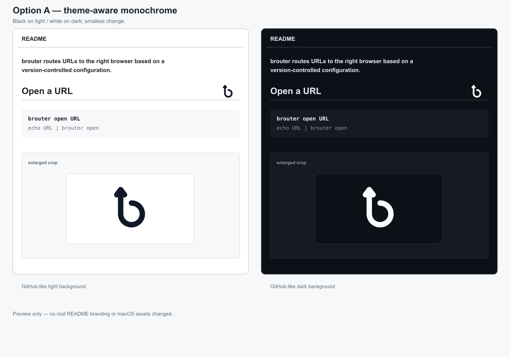
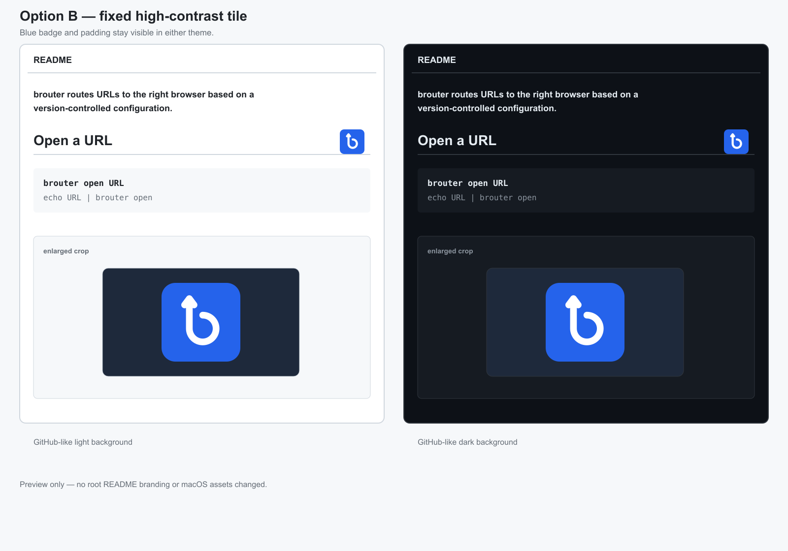
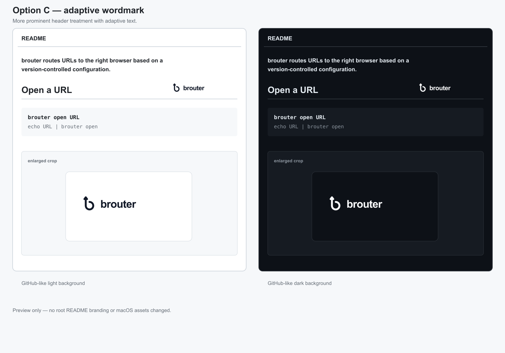

# README logo contrast previews

Preview-only alternatives for the small logo currently shown beside **Open a
URL** in the root README. The screenshot that prompted these options showed
the black candidate-C glyph disappearing against GitHub's dark README theme.
No option has been selected, and this directory does not change the root
README, macOS menu-bar icon, app assets, or personal configuration.

Each preview shows the intended README scale and an enlarged crop on both
GitHub-like light and dark backgrounds.

## Option A — theme-aware monochrome



Smallest change. Use explicit light and dark image sources; do not rely on
`currentColor`, because an SVG loaded through `` does not inherit the
README's text color.

```html
<picture>
  <source media="(prefers-color-scheme: dark)" srcset="docs/assets/readme-logo-previews/option-a-dark.svg">
  
</picture>
```

## Option B — fixed high-contrast tile



A blue tile with padding and a white mark. It has the same appearance in both
GitHub themes and needs one ordinary image, avoiding theme-media behavior.

```html

```

## Option C — adaptive wordmark



A more prominent header treatment. The mark and `brouter` wordmark use the
same explicit light/dark `<picture>` approach as Option A.

```html
<picture>
  <source media="(prefers-color-scheme: dark)" srcset="docs/assets/readme-logo-previews/option-c-dark.svg">
  
</picture>
```

## Review checklist

- Confirm the recognizable lowercase **b** and upward arrow at actual README scale.
- Check light and dark GitHub themes, including high-contrast settings if available.
- Keep the accessible label `brouter` independent of the glyph.
- Select one option before changing the root README. This preview branch intentionally does not auto-merge or alter runtime branding.
